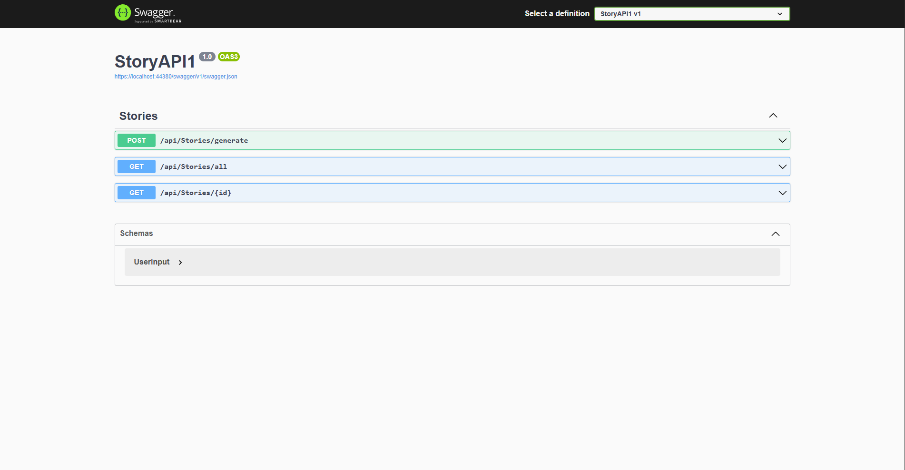
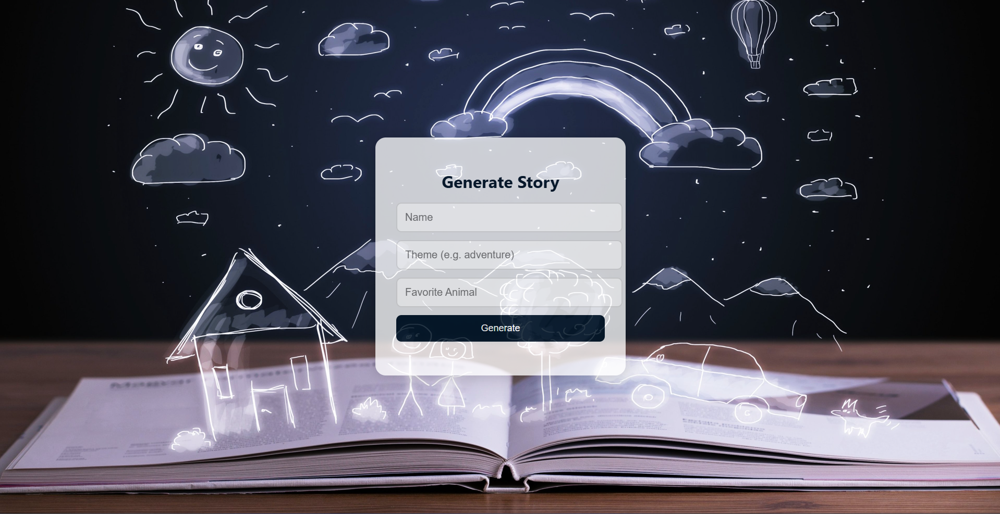

# Storytelling API with Text-to-Speech

A web application that generates personalized stories based on user input
(name, theme, and favorite animal) and converts the generated story into audio
using a Text-to-Speech service.

## Technologies Used
- ASP.NET Core Web API
- Swagger (OpenAPI)
- HTML, CSS, JavaScript
- Text-to-Speech API

## Features
- Generate personalized stories
- Text-to-Speech audio output
- RESTful API with Swagger documentation
- Simple frontend interface

## Project Structure
- StoryAPI1/        → ASP.NET Web API (backend)
- wwwroot/          → Frontend (HTML, CSS, JS)

## Setup Instructions
1. Clone the repository
2. Open the solution in Visual Studio
3. Set the required environment variable:
"ApiKey": "YOUR_API_KEY"
4. Run the application
5. Open Swagger or the frontend page

## Screenshots

### Swagger API

### Frontend Interface

